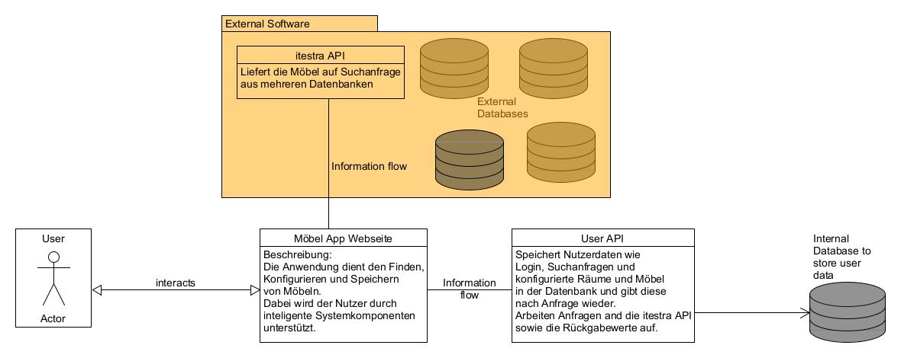
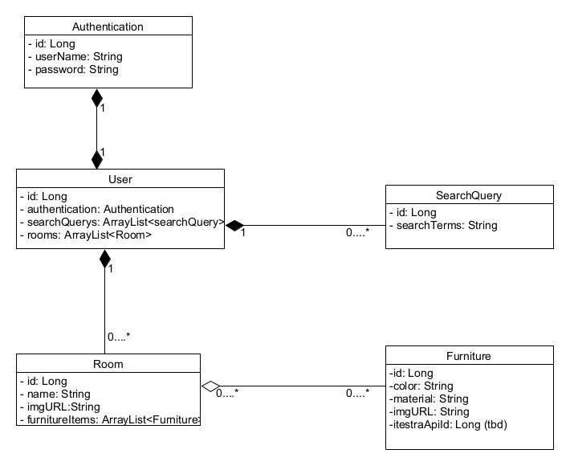
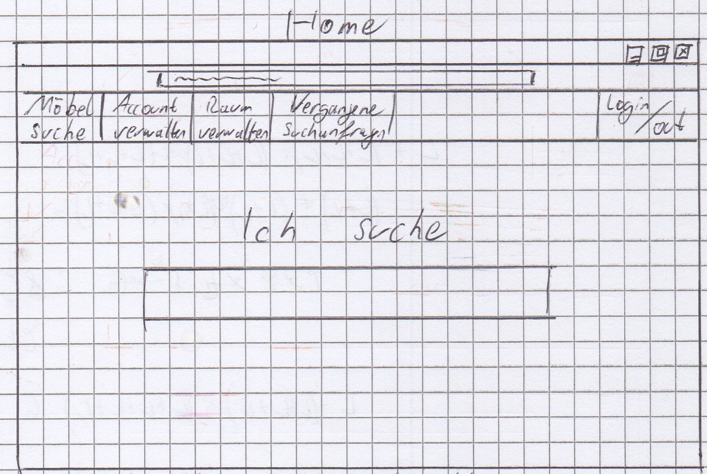
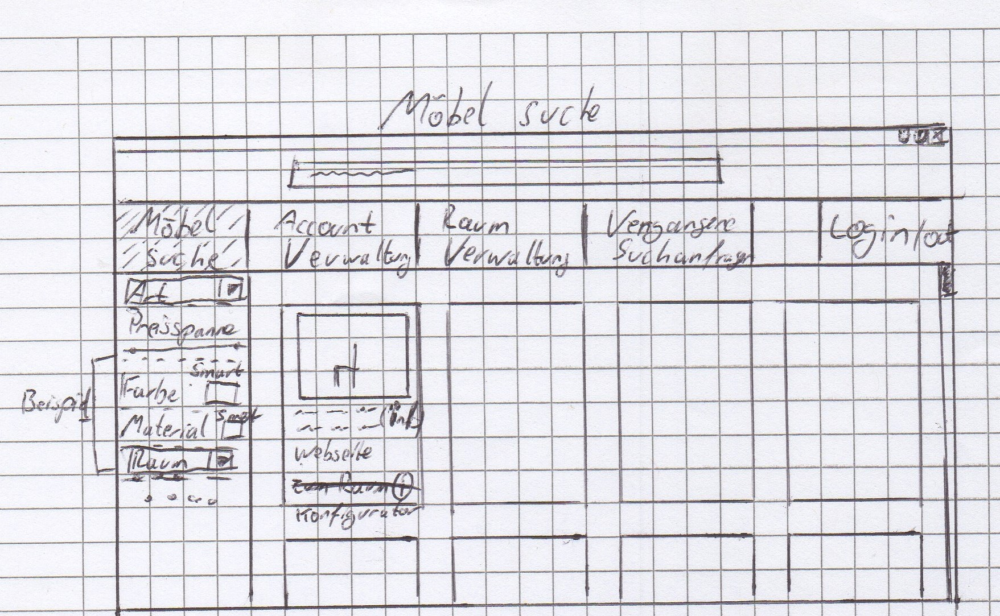

# Entwurf

> Dieser Entwurf legt die prinzipielle Lösungsarchitektur fest und enthält alles, was man benötigt, um einem Außenstehenden den prinzipiellen Aufbau der App erklären zu können.
> Der Fokus liegt auf einem groben Überblick und vereinzelten wichtigen Details (**keep it simple**).

Das Frontend bindet eine eigens erstellte API ein. Mit dieser lassen sich Nutzer anlege, welche Räume erstellen und darin Möbel abspeichern können. Diese Möbel werden als Grundlage genutzt, um Suchanfragen zu verbessern und Möbel zu finde, die in die schon vorhandene Einrichtung passen.
**Subject to change:** Die eigens erstellte API stellt dann die Suchanfragen and die itestra API und bearbeitet die Rückgabewerte für unser Frontend auf.

## System Context Diagram

## Domain Model

## Beschreibung der Java-Packages der API

- REST:  Ermöglicht komunikation zwischen Client und Middleware
- JDBC:  Ermöglicht Komunikation zwischen Middleware und Server 
- ORMLite : Ermöglicht Komunikation zwischen Middleware und Server 
- Bootstrap: Ermöglicht kommunikation zwischen Client und Middleware

## Beschreibung der Frontend-Views

- Home view: Suchseite, mit weiteren Optionen in der Menüleist, wie verweis zu anderen views.
- Account management: Zum passwort ändern, Account löschen oder erstellen
- Search management: Zum Anzeigen von vorangegangenen Suchanfragen, den Löschen oder wiederholen dieser
- Detailansicht: Einzelansicht eines Möbekstückes. Mit allen wichtigen Informationen.
- Raum verwaltung: Anlegen, löschen und Verwalten von Räumen. Zeigt die in den Räumen gespeicherten Möbel an, kann diese löschen oder in anzahl veringern.

## GUI-Skizze: Home-View

> Nutzern steht die Suche bereit. Durch das einlogen stehen weitere Funktionen zur Verfügung, etwa eine Möbelverwalten, die Suchanfragenverwaltung,....

## GUI-Skizze: Ausgewählte wichtige Detail-View

> Nutzer werden hier die gefundenen Möbel angezeigt. Kriterien, wie Preis können noch nacheingestellt werden

